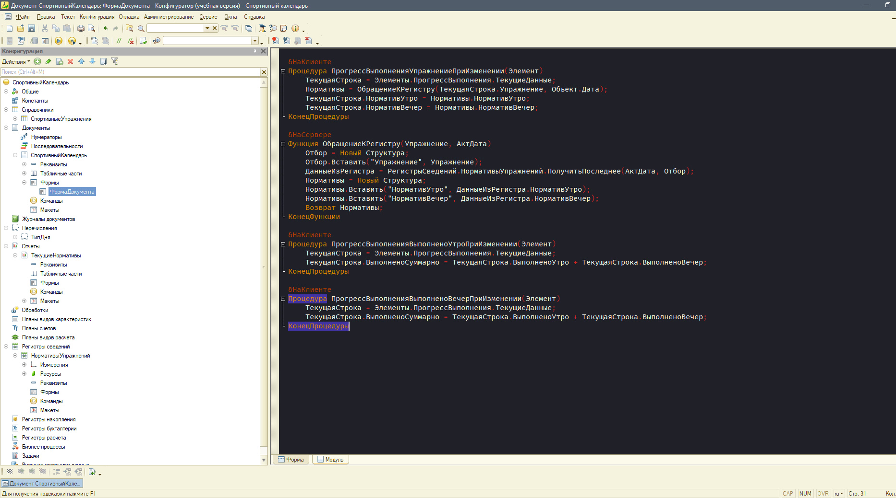
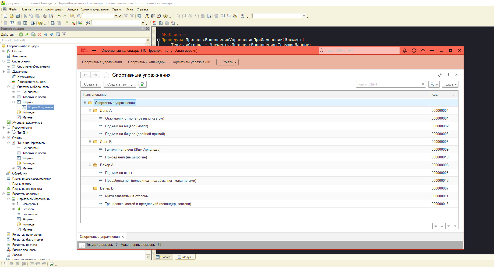
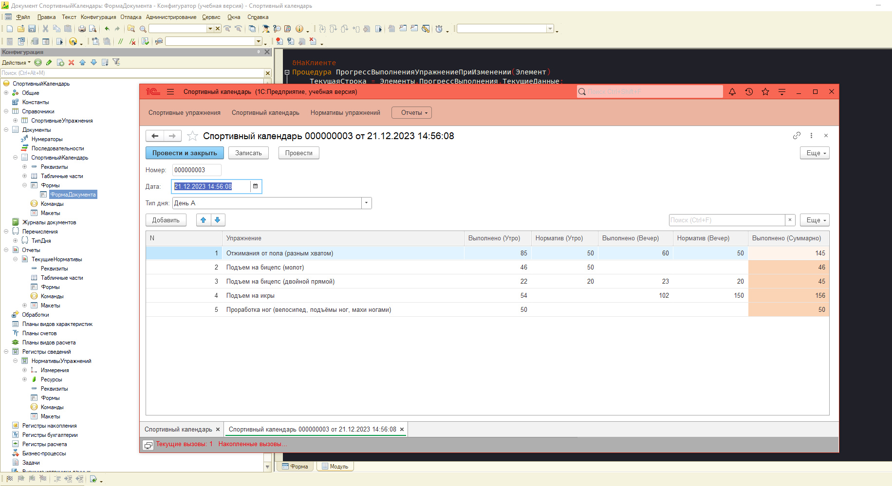

# Краткое описание проекта

Перед вами - небольшой самостоятельный проект, созданный на основе платформы 1С:Предприятие 8.3 (учебная версия). Данная конфигурация была придумана, спроектирована и разработана полностью с нуля, без использования каких-либо видеоуроков или туториалов.

Основная цель - ведение дневника (календаря) спортивных тренировок по схеме "Утро-Вечер".

 

**В конфигурации реализованы следующие функции:**

▪ Возможность записывать кастомный список упражнений в Справочнике (всё, что душа пожелает).

▪ Возможность создавать и освежать нормативы в регистре сведений (периодичность = в пределе дня).

▪ При выборе упражнения в документе, актуальные нормативы автоматически подставляются из регистра сведений. Сначала их туда, конечно же, нужно ввести 🙂

▪ Автоматический расчёт суммы выполненных повторений за день (суммируются утренние и вечерние повторения). Полезно, если баланс тренировок был смещён из-за большой занятости в определённый день.

▪ Возможность посмотреть информацию по установленным нормативам на различные даты (таким образом, можно отслеживать прогресс).

Нормативы можно и нужно постепенно обновлять (желательно увеличивать) по мере роста тренированности.

▪ Также специально для данного проекта была разработана и реализована новая тема оформления, более "агрессивная" по сравнению со стандартной - см. скриншоты чуть ниже.

 

**Примечание:** Автор прекрасно осознаёт, что данное приложение можно ещё долго улучшать и добавлять в него новые фишки, функции и отчёты, но пока такой необходимости не возникло. Возможно, по мере роста моего профессионализма в сфере 1С и появлении новых пожеланий по функциональности приложение будет обновляться. Но сейчас оно на 100% выполняет поставленную задачу, и я с удовольствием пользуюсь этим приложением каждый день, несмотря на его незамысловатость.

# Установка и запуск

Приложение можно установить в виде файловой информационной базы (конфигурация + примеры заполнения всех основных объектов конфигурации). Сама информационная база находится в [zip-архиве](https://github.com/sudomango/1C-Infobase-Sport-Manager/raw/main/%D0%A1%D0%BF%D0%BE%D1%80%D1%82%D0%B8%D0%B2%D0%BD%D1%8B%D0%B9%20%D0%9A%D0%B0%D0%BB%D0%B5%D0%BD%D0%B4%D0%B0%D1%80%D1%8C.zip). Можно также установить приложение импортом [файла конфигурации](https://github.com/sudomango/1C-Infobase-Sport-Manager/raw/main/%D0%A1%D0%BF%D0%BE%D1%80%D1%82%D0%B8%D0%B2%D0%BD%D1%8B%D0%B9%D0%9A%D0%B0%D0%BB%D0%B5%D0%BD%D0%B4%D0%B0%D1%80%D1%8C.cf), без каких-либо заполненных данных. Но для этого нужно будет создать новую информационную базу и импортировать в неё конфигурацию.

# Несколько скриншотов проекта

Программный модуль формы документа:

 

Справочник с записанными спортивными упражнениями:

 

Пример заполнения документа в течение дня:

